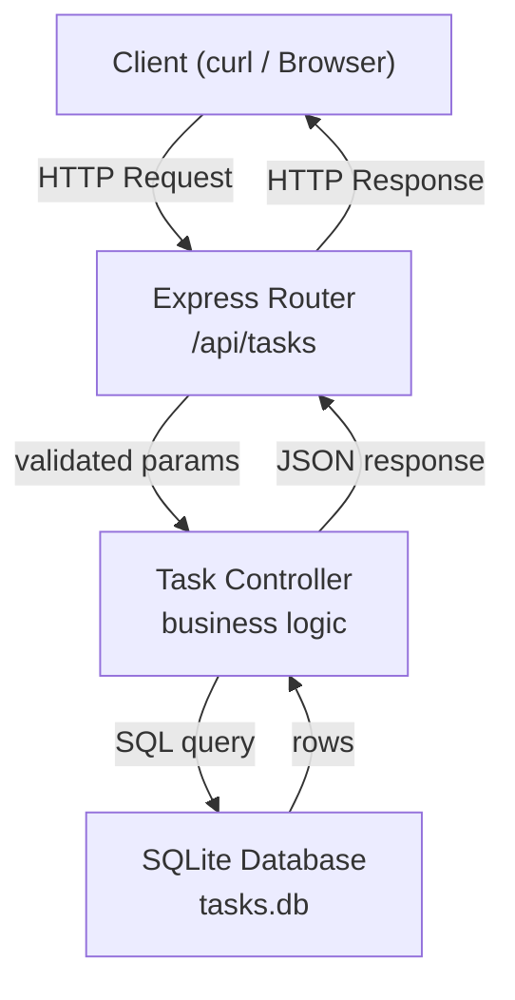
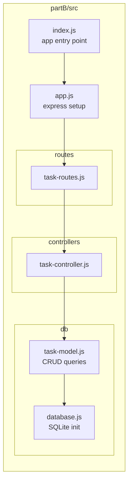
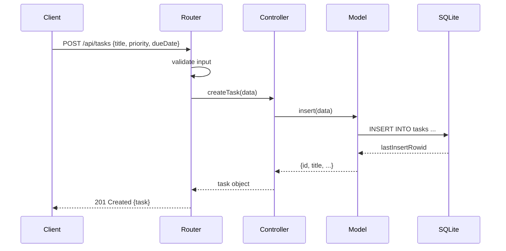
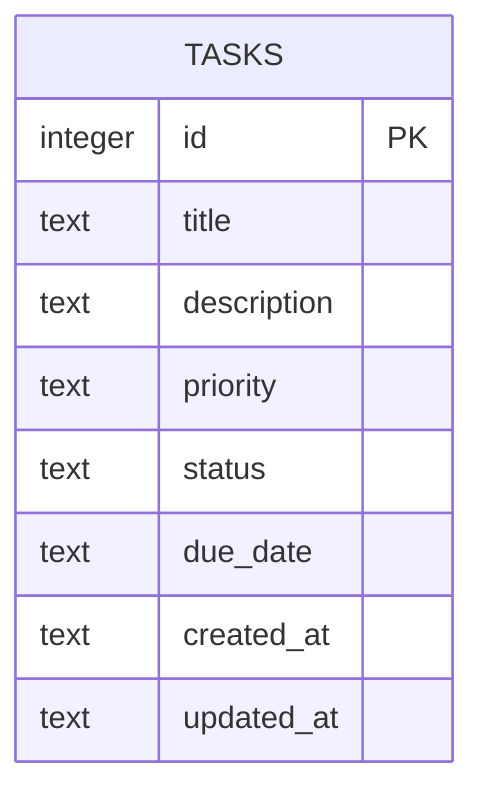

# ARCHITECTURE.md — Personal Task Tracker

## Системийн архитектур

### Layer Diagram

### Module бүтэц

### Data Flow — Task үүсгэх

### Database Schema

## Module тайлбар

| Module | Үүрэг |
|---|---|
| `index.js` | Сервер эхлүүлэх, port listen |
| `app.js` | Express middleware, router холбох |
| `task-routes.js` | HTTP endpoints тодорхойлох |
| `task-controller.js` | Request боловсруулах, хариу буцаах |
| `task-model.js` | SQLite CRUD операцууд |
| `database.js` | DB холболт, schema init |

## API Endpoints

| Method | Path | Тайлбар |
|---|---|---|
| GET | /api/tasks | Бүх таск жагсаах (filter боломжтой) |
| GET | /api/tasks/:id | Нэг таск харах |
| POST | /api/tasks | Шинэ таск үүсгэх |
| PUT | /api/tasks/:id | Таск засах |
| DELETE | /api/tasks/:id | Таск устгах |
| GET | /api/tasks/search | Хайлт |
